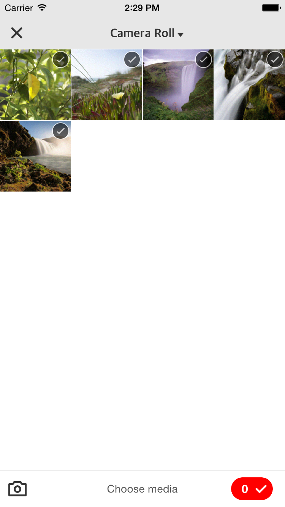

# CorePhotoPickerVCManager
# 照片选取器
# 注：本框架由iOS开发攻城狮Charlin制作
#### Charlin：四川成都华西都市报旗下华西都市网络有限公司技术部iOS工程师！
##版本特性
### 1.支持ios6及以上。
### 2.支持相册目录（后期支持视频选取）。
### 3.支持iPhone6/iPhone6 Plus及横竖屏。
### 4.支持相册直接拍摄、相册选取（单选），相册多选
### 5.相册多选支持最少选取张数，最多选取张数，并带有超出选取自动提示。
### 6.界面专业设计，界面美观。
### 7.支持设备不可用block回调。
### 8.整个使用过程你不再需要设置代理，全部使用block回调。
### 9.您如果需要不同的选取功能，直接在初始化的时候指定type即可

    CorePhotoPickerTypeCamera=0,                                                            //用户拍照
    
    CorePhotoPickerTypeSinglePhoto,                                                         //单张照片选取
    
    CorePhotoPickerTypeMultiPhoto,                                                          //多张照片选取
    
    CorePhotoPickerTypeVideo,                                                               //视频选取（暂不考虑，本框架仍可以完美支持）
    
    
#使用示例

    CorePhotoPickerVCManager *manager=[CorePhotoPickerVCManager pickerVCWithPikerType:CorePhotoPickerTypeMultiPhoto];
    
    _manager=manager;
    
    //最多可选3张
    manager.maxSelectedPhotoNumber=4;
    
    //错误处理
    if(manager.unavailableType!=CorePhotoPickerUnavailableTypeNone){
        NSLog(@"设备不可用");
        return;
    }
    
    UIViewController *pickerVC=manager.pickerVC;
    
    //选取结束
    manager.finishPickingMedia=^(NSArray *medias){
        
        [medias enumerateObjectsUsingBlock:^(CorePhoto *photo, NSUInteger idx, BOOL *stop) {
            NSLog(@"%@",photo.editedImage);
        }];
    };

    

    [self presentViewController:pickerVC animated:YES completion:nil];

#看看效果图吧

